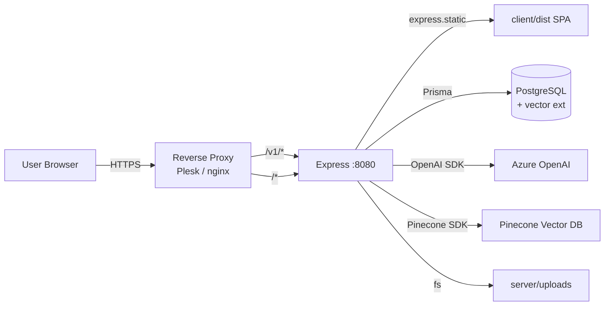
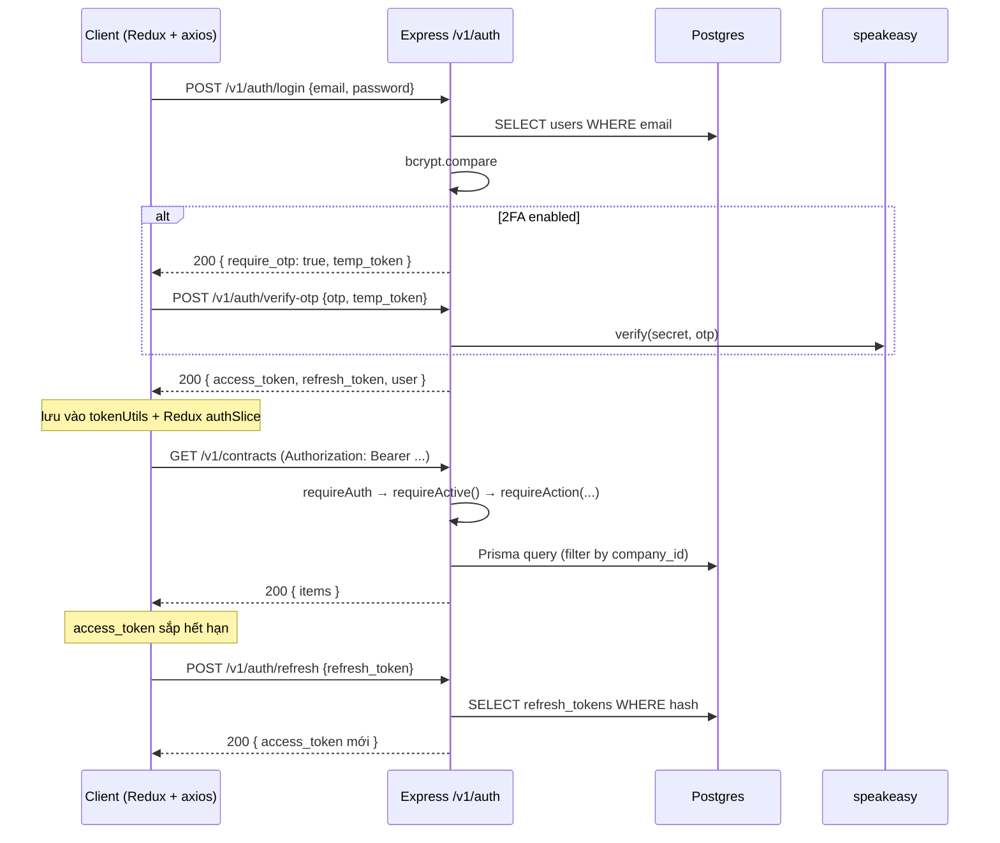
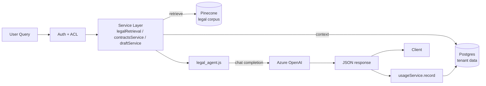

# Kiến trúc hệ thống — Legal AI Platform

> Tham chiếu chéo: `README.md`, `docs/API.md`, `docs/TECHNICAL_DOCUMENTATION.md`.

<!-- AUTO-GENERATED: do not edit -->

## 1. Tổng quan

Hệ thống monorepo split client/server, deploy single-process: backend Express phục vụ cả REST API (`/v1/*`) lẫn frontend static (`client/dist`).

---

## 2. Services và port

| Service | Process | Port | Run command | Trách nhiệm |
|---------|---------|------|-------------|------------|
| web+api | Node 22 (single process) | 8080 (prod) / 5173 (dev FE) | `npm start` (server) + `npm run dev` (client dev) | Express app: REST API + SPA static |
| db | PostgreSQL 14+ | 5432 | external (managed/local) | Primary datastore + pgvector |
| ai-llm | Azure OpenAI | https | external SaaS | Chat completion + embedding |
| ai-vector | Pinecone | https | external SaaS | Vector retrieval cho legal corpus |

> Không có Docker compose. Deploy hiện tại: Plesk Node.js app. Server phục vụ frontend static từ `client/dist` (`server/src/app.js:73`).

---

## 3. Layout source code

### 3.1 Frontend (`client/`)

| Path | Vai trò |
|------|---------|
| [client/src/main.jsx](../client/src/main.jsx) | Entry point — mount Redux Provider + Router |
| [client/src/App.jsx](../client/src/App.jsx) | Route shell, dashboard, auth flow |
| [client/src/store/](../client/src/store/) | Redux Toolkit: `authSlice`, `draftSlice`, `uiSlice` |
| [client/src/services/](../client/src/services/) | `apiClient` (axios + token refresh interceptor), `authService` |
| [client/src/utils/](../client/src/utils/) | `tokenUtils` (lưu/đọc/validate JWT), `fetchWithAuth` |
| [client/src/pages/](../client/src/pages/) | AdminPanel, ContractsManagement, DocumentsManagement, TemplatesManagement, LegalSearchPage, UserProfile, CategoryTagsManagement |
| [client/src/components/phase4/](../client/src/components/) | Dashboard phase 4: review, collaboration, compliance, search analytics, template hub, notifications |

### 3.2 Backend (`server/`)

| Path | Vai trò |
|------|---------|
| [server/index.js](../server/index.js) | HTTP server bootstrap |
| [server/src/app.js](../server/src/app.js) | Express app — middleware, routes, SPA fallback, healthcheck |
| [server/src/config/env.js](../server/src/config/env.js) | Validate env + CORS origins resolver |
| [server/src/config/storage.js](../server/src/config/storage.js) | Upload dir config |
| [server/src/middleware/auth.js](../server/src/middleware/auth.js) | JWT verify |
| [server/src/middleware/requireRole.js](../server/src/middleware/requireRole.js) | `requireActive()`, `requireSuperAdmin`, role gating |
| [server/src/middleware/rolePermissions.js](../server/src/middleware/rolePermissions.js) | `requireAction('upload:contracts')` style action-based ACL |
| [server/src/routes/](../server/src/routes/) | 12 route modules (xem `docs/API.md`) |
| [server/src/services/](../server/src/services/) | Business logic + AI integration (24 service files) |
| [server/src/agents/legal_agent.js](../server/src/agents/legal_agent.js) | Azure OpenAI client + `initAI`/`getAIStatus` |
| [server/src/services/pinecone.js](../server/src/services/pinecone.js) | Pinecone init + retrieval |
| [server/src/lib/prisma.js](../server/src/lib/prisma.js) | Prisma client + `getPrismaHealth` |
| [server/src/lib/bootstrap.js](../server/src/lib/bootstrap.js) | `ensureMvpTables()` — chạy 1 lần khi boot |
| [server/prisma/schema.prisma](../server/prisma/schema.prisma) | 49 model (Company, User, Contract, Document, Draft, Template, Review, Compliance, Audit...) |

### 3.3 Database (`database/`, `migrations/`)

Phase migrations (chạy theo thứ tự):

1. `database/init.sql` — schema gốc + extension `vector`
2. `database/migration_phase3_review_system.sql`
3. `database/migration_phase3_collaboration.sql`
4. `database/migration_phase3_advanced.sql`
5. `database/migration_phase3_compliance.sql`
6. `database/migration_agentic_tools.sql`
7. `database/migration_llm_providers.sql`
8. `database/migration_platform_admin.sql`
9. `migrations/add_admin_features.sql`

### 3.4 Scripts ETL (`scripts/`)

- `crawl_laws.py` — crawl văn bản pháp luật
- `embed_laws.py` / `generate_embeddings.py` — sinh embedding
- `index_chunks.py` — index vào Pinecone
- `load_law_data.py` — load vào Postgres
- `run_migration.py` — helper chạy migration

---

## 4. Auth & session flow

---

## 5. Multi-tenant + permission model

- **Tenant scope**: mọi user thuộc 1 `Company` (`users.company_id`). Mọi truy vấn nghiệp vụ filter theo `company_id`.
- **Role**: `owner` / `admin` / `member` / `viewer` (enum `UserRole` + cờ superadmin riêng).
- **ACL**: action-based — middleware `requireAction('review:contracts')` thay vì role-based thuần.
- **API key**: bảng `api_keys` (key_hash + key_prefix + permissions array) — route `/v1/integration/*` dùng API key thay JWT.
- **Audit**: bảng `audit_logs` ghi nhận thao tác nghiệp vụ quan trọng.

---

## 6. AI flow

Các service AI chính:
- `legalRetrieval.js` — retrieval + citation
- `contractsService.js` — review rủi ro hợp đồng
- `complianceService.js` — compliance check draft
- `clauseService.js` + `clauseSuggestion` — đề xuất điều khoản
- `searchService.js` — search hybrid (text + vector)

---

## 7. Data model (49 Prisma models — grouped)

| Nhóm | Models |
|------|--------|
| **Tenant + user** | Company, User, ApiKey, RefreshToken |
| **Content** | Contract, Document, Category, Tag, ContractTag, DocumentTag, Template, TemplateVersion |
| **Drafting** | DraftGenerated, DraftVersion, Clause, ClauseSuggestion, ClauseConflict |
| **Review & approval** | ReviewSession, ReviewAssignment, ReviewComment, RiskAssessment, ApprovalRoute, ApprovalStage |
| **Collaboration** | DraftAccess, DraftCollaborator, DraftSharing, Mention, ActivityLog, Notification, NotificationPreference, NotificationQueue |
| **Compliance & audit** | AuditTrail, AuditLog, DigitalSignature, LegalHold, ComplianceCheck, DocumentLifecycle |
| **Chat / AI** | ChatSession, Message, Analytic, TeamMetric |
| **Search** | SearchIndex, SavedSearch |
| **Reminders** | Reminder, ReminderSchedule |
| **Integration** | IntegrationConfig, ExportHistory, Webhook, WebhookDelivery |

Chi tiết: `server/prisma/schema.prisma`.

---

## 8. Cross-cutting concerns

| Concern | Implementation |
|---------|----------------|
| **CORS** | `getCorsOrigins()` đọc `CORS_ORIGINS` + `FRONTEND_URL`, default localhost (`server/src/config/env.js:25`) |
| **Rate limit** | `express-rate-limit` áp ở `/v1/auth/login` + `/v1/auth/verify-otp` |
| **Trust proxy** | `app.set('trust proxy', 1)` — rate-limit lấy đúng IP qua Plesk/nginx |
| **Helmet** | bật, CSP tắt (SPA Vite cần inline) — đặt CSP ở reverse proxy nếu cần chặt |
| **Upload** | `multer` → `server/uploads/{contracts,documents,templates}/` — phục vụ qua `/uploads/*` |
| **SPA fallback** | regex `^(?!\/v1\|\/uploads).*$` → `client/dist/index.html` |
| **Healthcheck** | `GET /v1/health` — kiểm tra DB + AI + Pinecone, trả 503 nếu DB down |
| **Error handling** | global middleware ở cuối `app.js`, log stack + trả generic 500 |

---

## 9. Phase context (vibe lifecycle)

Project hiện tại **lệch template chuẩn Mắt Bão** (giống `dashboard-omicall`):
- KHÔNG có Next.js/MariaDB — dùng split React+Vite + Express+Postgres
- KHÔNG có Docker compose / Coolify deploy
- Deploy custom qua Plesk → `legalmb.cloud`
- `docs/skills-lock.json` cho thấy đã dùng skill `accessibility`, `frontend-design`, `seo` từ external pack

Theo AI Factory pipeline, project đang ở **Phase 3 — Productization** (đã có Plesk deploy, security harden, helmet, rate-limit). Migration sang Coolify cần Dockerfile multi-stage (xem feedback `coolify-compose-broken`).

<!-- /AUTO-GENERATED -->

<!-- CUSTOM -->
<!-- User-written notes go here, between CUSTOM markers — sẽ không bị overwrite ở lần regenerate kế tiếp -->
<!-- /CUSTOM -->
